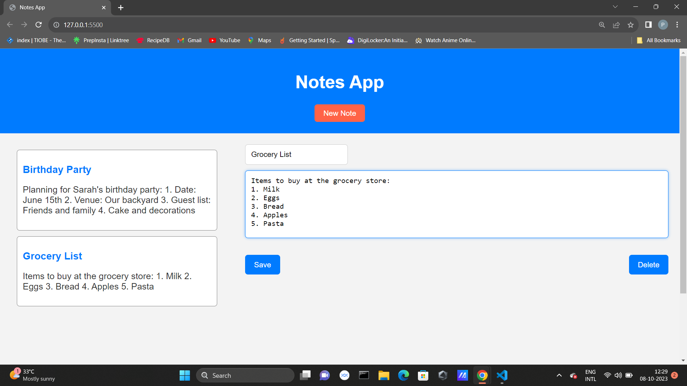

# Notes App

A simple web-based note-taking application built with HTML, CSS, and JavaScript.

## Features

- Create and save notes.
- Edit and delete notes.
- Responsive design for mobile and desktop.

## Technologies Used

- HTML
- CSS
- JavaScript

## Getting Started

To get started with this project, follow these steps:

1. Clone this repository to your local machine.
2. Open the `index.html` file in your web browser to use the Notes App.

## Usage

- Click "New Note" to create a new note.
- Enter a title and content for your note.
- Click "Save" to save the note.
- Click on a saved note to edit it.
- Click "Delete" to remove a note.

## Screenshot

## License

This project is licensed under the MIT License - see the [LICENSE](LICENSE) file for details.

## Acknowledgments

- Thanks to [OpenAI](https://openai.com) for their AI assistance in creating this project!

